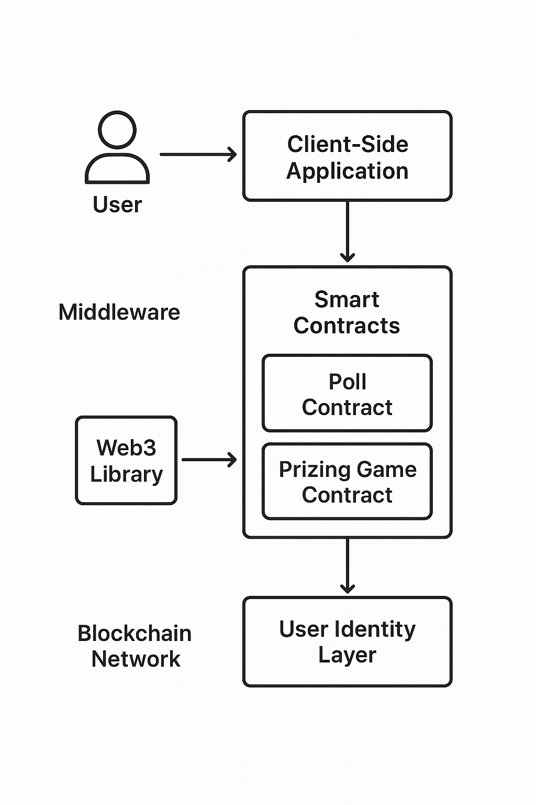

# Hup: The Inverse Social Network
Hup is a new kind of social platform built on a decentralized network. It redefines social interaction by putting the user back in control of their identity, data, and social graph. We're not building a new app; we're building a new foundation for a more open, transparent, and user-owned social experience.

# ✨ The Vision
Centralized social networks have become a part of our daily lives, but they come at a cost. They control our data, dictate our experiences, and monetize our attention.

Hup's vision is to change this. By leveraging blockchain technology, we are building an "inverse social network" where your digital identity is an asset you own. Your profile is not a product—it's your key to a truly decentralized social ecosystem.

# 🚀 Key Features
On-Chain Polls
Our polls are a simple, yet powerful example of what is possible. Every vote is tied to a unique digital identity, ensuring a verifiable and bot-free voting experience. This is the first step toward creating provably fair and authentic engagement.

Community-Owned Games
Hup includes a mini-game where users can participate in a mystery box game with guaranteed prizes. The game's logic is transparent and verifiable on-chain, ensuring fair play for all participants.

Direct Monetization
Creators and communities can monetize their engagement directly through our platform. Whether it's a small fee to participate in a poll or a game, the value flows directly to the content creator, removing the need for a centralized middleman.

# 💡 How It Works
Hup leverages a robust and scalable blockchain to provide the underlying security and immutability. Each user's identity is an individual smart contract that they own, which acts as their on-chain profile. This profile serves as the source of truth for their data and interactions across the network.

# 🤝 Contribution
This project is open source, and we welcome contributions from developers, designers, and thinkers. Whether you are a blockchain expert or just starting out, your help can make a difference.

## To get started:

Fork this repository.

Clone your forked repository.

Install dependencies and follow the setup instructions in the CONTRIBUTING.md file.

Join our community to discuss ideas, report bugs, or just say hello!

📄 License
This project is licensed under the MIT License.

# Contract address
https://shannon-explorer.somnia.network/tx/0x66a89fd609cb12f910e9d1c4a4e6a5ef7f177b6ccbda9431006e06e86ce6077a

# User flow

# pitch deck slides

<iframe style="border: 1px solid rgba(0, 0, 0, 0.1);" width="800" height="450" src="https://embed.figma.com/slides/WGFu8vMg4NvveEUgUqN2MJ/hup-somnia-hackathon?node-id=1-42&embed-host=share" allowfullscreen></iframe>